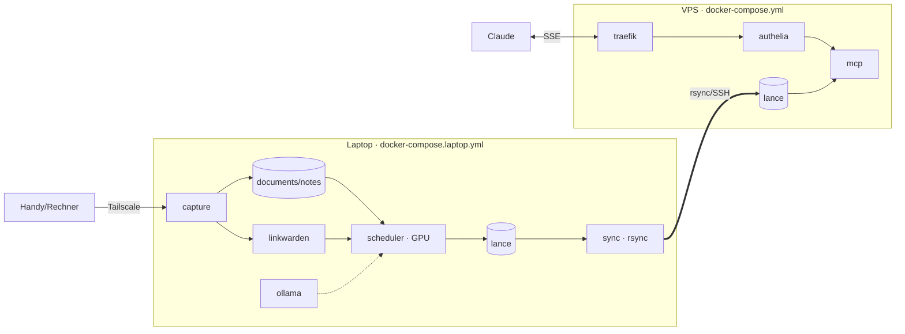

# deploy/

**Docker-first auf beiden Maschinen** — am Host ist nur Docker nötig (am Laptop
zusätzlich das NVIDIA Container Toolkit für die GPU). Bewusste Trennung:

- **Laptop (Erstellen):** `docker-compose.laptop.yml` — Capture, Scheduler
  (Embedding auf der GPU), Ollama, Linkwarden (+Postgres) und ein rsync-Sidecar.
- **VPS (Abfragen):** `docker-compose.yml` — Traefik + Authelia + MCP-Server
  (CPU). Liest nur den per rsync gespiegelten `lance`-Index.



## Dateien

| Datei | Seite | Zweck |
|---|---|---|
| `Dockerfile` | VPS | schlankes CPU-Image (MCP-Server) |
| `Dockerfile.cuda` | Laptop | CUDA-Image (Capture + Scheduler) |
| `docker-compose.laptop.yml` | Laptop | capture, scheduler, ollama, linkwarden, postgres, sync |
| `docker-compose.yml` | VPS | traefik, authelia, mcp |
| `.env.example` | beide | Compose-Variablen (→ `deploy/.env`) |
| `authelia/*.example.yml` | VPS | Authelia-Vorlagen |
| `systemd/`, `cron/` | Laptop | **Alternative** ohne Docker (bare-metal) |

## Laptop in Betrieb nehmen

Voraussetzung: Docker + **NVIDIA Container Toolkit** installiert.

```bash
cp deploy/.env.example deploy/.env     # Secrets, SSH_KEY, VPS_SSH_TARGET … setzen

docker compose -f deploy/docker-compose.laptop.yml up -d --build

# Ollama-Modell einmalig ziehen
docker compose -f deploy/docker-compose.laptop.yml exec ollama ollama pull llama3.2

# Capture im Tailnet veröffentlichen (nur Tailnet-Mitglieder, HTTPS)
tailscale serve --bg 8765
```

Der Scheduler verarbeitet die Inbox dann periodisch (`PROCESS_INTERVAL`), der
sync-Sidecar schiebt den Index zum VPS (`VPS_SSH_TARGET`, `SYNC_INTERVAL`).
Linkwarden ist unter `http://localhost:3000` erreichbar; dort ein Access-Token
erzeugen und als `LINKWARDEN_TOKEN` in `deploy/.env` eintragen.

## VPS in Betrieb nehmen

```bash
cp deploy/.env.example deploy/.env     # DOMAIN, ACME_EMAIL …

# Authelia konfigurieren (Secrets NICHT ins Repo)
cp deploy/authelia/configuration.example.yml   deploy/authelia/configuration.yml
cp deploy/authelia/users_database.example.yml  deploy/authelia/users_database.yml
#   -> Secrets/Hashes setzen, default_policy bleibt deny

docker compose -f deploy/docker-compose.yml up -d --build
```

Das rsync-Ziel auf dem VPS (`VPS_SSH_TARGET`) muss auf das hier gemountete
`deploy/../data/lance` zeigen.

## Hinweise

- **GPU**: nur der `scheduler` reserviert die NVIDIA-GPU; `capture` läuft auf CPU.
- **Wecken**: Tailscale weckt den Laptop nicht — er muss online sein.
- **Ohne Docker**: `systemd/` + `cron/` sind die bare-metal-Alternative (lokales
  venv) und für den reinen Docker-Betrieb nicht nötig.
- **Vertraulichkeit**: alle Daten landen auf dem VPS — Absicherung (TLS, 2FA,
  Rate Limiting) ist Pflicht (siehe `CLAUDE.md`).
