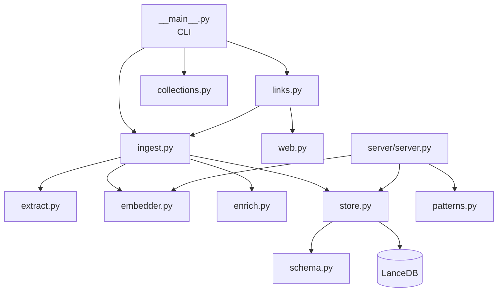
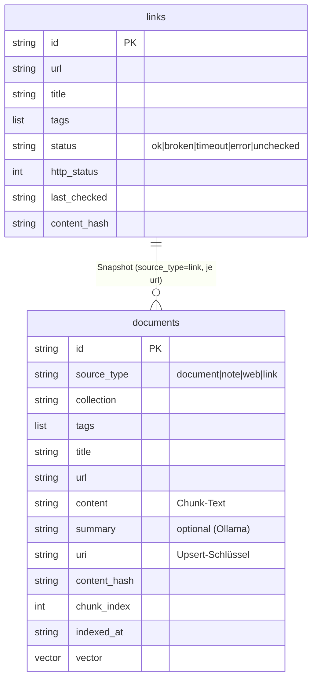

# Architektur & Modelle

## Hardware und Arbeitsteilung

Lokaler Betrieb auf einer GPU mit **4 GB VRAM** und **64 GB RAM**. Der **VRAM
ist der Engpass**, nicht der RAM. Daraus folgt:

- Embedding und Reranking laufen auf der **GPU** (knappes Budget, FP16).
- LLM-Anreicherung (Ollama) läuft auf **CPU/RAM**, um nicht um VRAM zu
  konkurrieren.
- Bei der Indexierung erst alle Embeddings (GPU), dann Anreicherung (CPU).

## Paketstruktur



Geteilte Logik liegt im Paket `mykb/`; `server/` und die CLI sind dünn. Der
Embedder wird von **Ingestion und Server** gemeinsam genutzt — so bleibt das
asymmetrische Embedding garantiert konsistent.

## Datenmodell



## Modellwahl

| Rolle | Modell | Lizenz | VRAM (FP16) | Begründung |
|---|---|---|---|---|
| Embedder | `Qwen/Qwen3-Embedding-0.6B` | Apache 2.0 | ~1,2 GB | DE+EN nativ, 32k Kontext, Matryoshka |
| Embedder (Qualität) | `boboliu/Qwen3-Embedding-4B-W4A16-G128` | Apache 2.0 | ~2,5 GB | bessere Treffer, dann Reranker auf CPU |
| Reranker | `Alibaba-NLP/gte-multilingual-reranker-base` | Apache 2.0 | ~0,6 GB | kommerziell nutzbar, multilingual |
| Anreicherung | lokal via Ollama (z. B. `llama3.2`) | je Modell | CPU/RAM | Zusammenfassung + Auto-Tags |

!!! note "Lizenzpolitik (gelockert)"
    Für selbst gehostete **Tooling-Bibliotheken** sind auch Copyleft-Lizenzen
    (z. B. trafilatura, GPLv3) in Ordnung. Bei **Modellen**, die in bezahlter
    Beratung Ergebnisse liefern, bleibt eine kommerziell nutzbare Lizenz die
    Voreinstellung; ein non-commercial Modell wie der Jina-Reranker (cc-by-nc)
    ist nur als optionale Alternative für rein private Nutzung gedacht.

## Asymmetrisches Embedding

Qwen3 ist **asymmetrisch**: *Queries* bekommen einen Instruction-Prefix,
*Passages* nicht.

- Beim **Indexieren** (`Embedder.encode_passages`) werden Inhalte ohne Prefix
  kodiert.
- Beim **Suchen** (`Embedder.encode_query`) wird der Prefix gespiegelt:

  ```
  Instruct: Given a search query, retrieve relevant passages from a personal
  knowledge base of documents, notes and saved web content
  Query: <die eigentliche Anfrage>
  ```

Beide Seiten nutzen dasselbe Modell und dieselbe (ggf. per `EMBED_DIM`
gekürzte) Dimension — sonst sind die Vektoren nicht vergleichbar.

## Stack

| Komponente | Technologie |
|---|---|
| Vektor-DB | LanceDB (serverless, lokale Dateien) |
| Embeddings | sentence-transformers + Qwen3 |
| Web-Extraktion | httpx + trafilatura (Fallback BeautifulSoup) |
| Anreicherung | Ollama (lokaler LLM, CPU) |
| Bookmarks | Linkwarden (API-Connector) |
| MCP-Server | FastMCP (Python), SSE-Transport |
| Container | Docker Compose · Traefik · Authelia |
| Logging | structlog (JSON) |

## Offene Punkte

1. **Reranking** produktiv schalten (Top-K → Top-N mit gte-reranker).
2. **Hybrid-Retrieval** prüfen: BGE-M3 (dense + sparse) für exakte Fachbegriffe.
3. **VPS-Sync** festlegen (rsync vs. S3) und automatisieren.
4. **Breitere Capture-Quellen** (Readwise, YouTube-Transkripte, OCR).

Details und Begründungen stehen in der `CLAUDE.md` im Repository.
