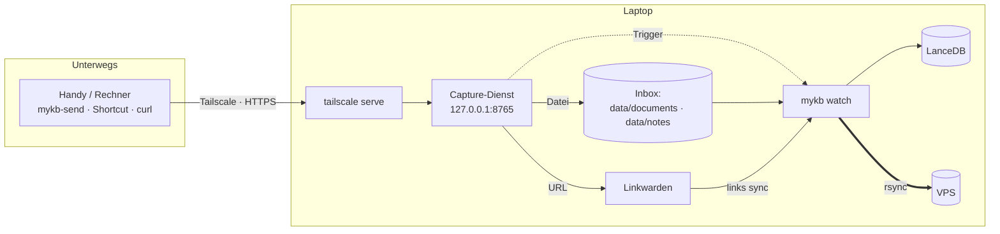
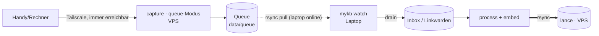

# Von unterwegs erfassen (Tailscale)

Dokumente und Links lassen sich von überall an den Laptop übergeben — über das
bestehende **Tailscale**-Netz. Ein schlanker **Capture-Dienst** nimmt Übergaben
entgegen (Datei → Quellordner, Link → Linkwarden) und **setzt einen Trigger**.
Der Watcher (`mykb watch`) verarbeitet daraufhin **debounced und zeitnah** und
spiegelt den Index direkt im Anschluss zum VPS — Erfasstes ist so in der Regel
nach 1–2 Minuten durchsuchbar statt erst nach einem Intervall.



!!! info "Direkt-Modus: der Laptop muss online sein"
    Im oben gezeigten `direct`-Modus läuft der Annahmepunkt auf dem Laptop. Ist er
    aus/schlafend, schlägt die Übergabe fehl. Dagegen hilft der **Queue-Modus**.

## Ausfallsicherheit: Queue auf dem VPS

Damit nichts verloren geht, wenn der Laptop aus ist, läuft der Annahmepunkt als
**Queue-Intake** auf dem **immer-erreichbaren VPS** (im Tailnet). Übergaben werden
dort durabel eingereiht; der Laptop **zieht** die Queue per rsync und verarbeitet
sie, sobald er wieder läuft.



- **VPS** (`docker-compose.yml`, Service `capture` mit `CAPTURE_MODE=queue`):
  nimmt `/capture/url` und `/capture/file` entgegen und reiht sie durabel ein
  (atomar; ein Eintrag = `<id>.json` plus ggf. `<id>.bin`).
- **Laptop** (`scheduler`/`mykb watch`): zieht die Queue alle `QUEUE_POLL`
  Sekunden per `rsync --remove-source-files` (entfernt sie an der Quelle),
  `drain`t sie (Datei → Inbox, Link → Linkwarden) und stößt die Verarbeitung an.

Konfiguration: VPS-Intake unter `tailscale serve --bg 8765` veröffentlichen;
am Laptop `QUEUE_PULL_SOURCE=user@vps:/srv/mykb/data/queue/` setzen. Manuell
leeren geht mit `python -m mykb drain`.

!!! note "Was die Queue (nicht) löst"
    Übergaben gehen nicht verloren und der Client bekommt nie einen Fehler. Die
    **Verarbeitung** (Embedding) passiert weiterhin erst, wenn der Laptop läuft —
    die GPU sitzt dort. Die Queue entkoppelt also Annahme von Verarbeitung.

## Dienst starten und im Tailnet veröffentlichen

Der Dienst bindet bewusst an **localhost**; die Veröffentlichung im Tailnet
(HTTPS via MagicDNS, nur für Tailnet-Mitglieder) übernimmt `tailscale serve`.
Ein eigener Token entfällt — der Zugriffsschutz läuft über die
Tailnet-Identität/ACLs.

```bash
# 1. Capture-Dienst auf dem Laptop
python -m mykb capture                 # lauscht auf 127.0.0.1:8765

# 2. Im Tailnet als HTTPS veröffentlichen (nur Tailnet-Mitglieder)
tailscale serve --bg 8765
tailscale serve status                 # zeigt die URL

# erreichbar als:  https://<laptop>.<tailnet>.ts.net/
```

## Verarbeitung

Im **Docker-Betrieb** übernimmt das der `scheduler`-Container automatisch
(`mykb watch`): er reagiert auf den Capture-Trigger (Ruhezeit `PROCESS_DEBOUNCE`,
damit Bursts gebündelt werden), bzw. spätestens nach `PROCESS_INTERVAL`, und
spiegelt danach direkt per rsync zum VPS.

```bash
# läuft als scheduler-Container; manuell zum Testen:
python -m mykb watch          # Trigger-gesteuert + Fallback-Intervall
python -m mykb process        # einmaliger Lauf (index + links sync)
```

!!! tip "Ohne Docker"
    Statt `watch` kann `mykb process` per systemd-Timer (empfohlen) oder Cron
    laufen — Vorlagen unter `deploy/systemd/` und `deploy/cron/`. Der
    systemd-Timer holt mit `Persistent=true` verpasste Läufe nach.

## Übergeben

### Mit dem Helfer `mykb-send`

```bash
export MYKB_CAPTURE_URL=https://laptop.<tailnet>.ts.net

scripts/mykb-send.sh url  https://example.org/artikel "infosec,lesen" "kurze Notiz"
scripts/mykb-send.sh file ~/Downloads/paper.pdf document forschung
scripts/mykb-send.sh file ~/notizen/idee.md note
```

### Mit curl

```bash
# Link -> Linkwarden
curl -X POST https://laptop.<tailnet>.ts.net/capture/url \
  -H "Content-Type: application/json" \
  -d '{"url":"https://example.org","tags":["lesen"],"note":""}'

# Datei -> Inbox (document|note, optional collection)
curl -X POST https://laptop.<tailnet>.ts.net/capture/file \
  -F kind=document -F collection=infosec -F file=@./paper.pdf
```

### Vom Handy (iOS Kurzbefehle / Android)

Einen Kurzbefehl/Share-Sheet-Eintrag anlegen, der den geteilten Inhalt per
**POST** an die Capture-URL schickt — URLs an `/capture/url` (JSON), Dateien an
`/capture/file` (Multipart). So genügen zum Erfassen zwei Taps.

## Endpunkte

| Methode | Pfad | Zweck |
|---|---|---|
| `GET` | `/health` | Statusprüfung |
| `POST` | `/capture/url` | URL an Linkwarden übergeben (JSON: `url`, `tags`, `note`, `collection`) |
| `POST` | `/capture/file` | Datei in die Inbox (Multipart: `file`, `kind`, `collection`) |

Hochgeladene Dateinamen werden entschärft (kein Pfad-Traversal); übergebene
Links landen via Linkwarden-API als Bookmark und kommen beim nächsten
`links sync` in den Index.
