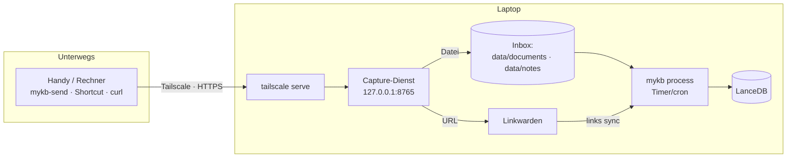

# Von unterwegs erfassen (Tailscale)

Dokumente und Links lassen sich von überall an den Laptop übergeben — über das
bestehende **Tailscale**-Netz. Ein schlanker **Capture-Dienst** nimmt Übergaben
entgegen und legt sie in die **Inbox** (Datei → Quellordner, Link → Linkwarden).
Das eigentliche Embedding macht ein späterer `mykb process`-Lauf.



!!! info "Der Laptop muss online sein"
    Tailscale stellt die Verbindung her, **weckt** den Laptop aber nicht. Ist er
    aus/schlafend, schlägt die Übergabe fehl (per Wake-on-LAN über einen anderen
    Tailnet-Knoten ließe sich das ergänzen).

## Dienst starten und im Tailnet veröffentlichen

Der Dienst bindet bewusst an **localhost**; die Veröffentlichung im Tailnet
(HTTPS via MagicDNS, nur für Tailnet-Mitglieder) übernimmt `tailscale serve`.
Ein eigener Token entfällt — der Zugriffsschutz läuft über die
Tailnet-Identität/ACLs.

```bash
# 1. Capture-Dienst auf dem Laptop
python -m mykb capture                 # lauscht auf 127.0.0.1:8765

# 2. Im Tailnet als HTTPS veröffentlichen (nur Tailnet-Mitglieder)
tailscale serve --bg 8765
tailscale serve status                 # zeigt die URL

# erreichbar als:  https://<laptop>.<tailnet>.ts.net/
```

## Inbox verarbeiten

Übergaben werden nur entgegengenommen. Die schwere GPU-Arbeit erledigt:

```bash
python -m mykb process        # index (documents+notes) + links sync
python -m mykb process --enrich
```

!!! tip "Planmäßig verarbeiten"
    `mykb process` per systemd-Timer/Cron laufen lassen (z. B. stündlich), dann
    ist Erfasstes ohne Handgriff bald durchsuchbar.

## Übergeben

### Mit dem Helfer `mykb-send`

```bash
export MYKB_CAPTURE_URL=https://laptop.<tailnet>.ts.net

scripts/mykb-send.sh url  https://example.org/artikel "infosec,lesen" "kurze Notiz"
scripts/mykb-send.sh file ~/Downloads/paper.pdf document forschung
scripts/mykb-send.sh file ~/notizen/idee.md note
```

### Mit curl

```bash
# Link -> Linkwarden
curl -X POST https://laptop.<tailnet>.ts.net/capture/url \
  -H "Content-Type: application/json" \
  -d '{"url":"https://example.org","tags":["lesen"],"note":""}'

# Datei -> Inbox (document|note, optional collection)
curl -X POST https://laptop.<tailnet>.ts.net/capture/file \
  -F kind=document -F collection=infosec -F file=@./paper.pdf
```

### Vom Handy (iOS Kurzbefehle / Android)

Einen Kurzbefehl/Share-Sheet-Eintrag anlegen, der den geteilten Inhalt per
**POST** an die Capture-URL schickt — URLs an `/capture/url` (JSON), Dateien an
`/capture/file` (Multipart). So genügen zum Erfassen zwei Taps.

## Endpunkte

| Methode | Pfad | Zweck |
|---|---|---|
| `GET` | `/health` | Statusprüfung |
| `POST` | `/capture/url` | URL an Linkwarden übergeben (JSON: `url`, `tags`, `note`, `collection`) |
| `POST` | `/capture/file` | Datei in die Inbox (Multipart: `file`, `kind`, `collection`) |

Hochgeladene Dateinamen werden entschärft (kein Pfad-Traversal); übergebene
Links landen via Linkwarden-API als Bookmark und kommen beim nächsten
`links sync` in den Index.
