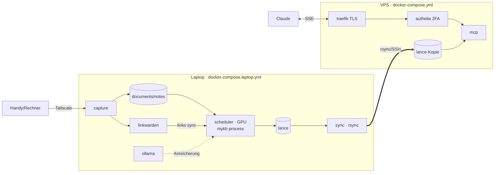

# Deployment

mykb läuft **Docker-first** auf zwei Maschinen — am Host ist nur Docker nötig
(am Laptop zusätzlich das **NVIDIA Container Toolkit** für die GPU). Bewusste
Trennung: **Erstellen** (Laptop, GPU) und **Abfragen** (VPS, CPU).



!!! danger "Alle Daten landen auf dem VPS"
    Der gesamte `lance`-Index wird auf den VPS gespiegelt — also können auch
    **private/vertrauliche Inhalte** remote liegen. Absicherung ist daher
    **Pflicht**: TLS, Authelia 2FA, Rate Limiting, Logging. Streng vertrauliche
    Dokumente im Zweifel in einer getrennten, lokalen Instanz halten.

## Laptop (Erstellen)

`docker-compose.laptop.yml` startet **capture**, **scheduler** (Embedding auf
der GPU), **ollama**, **linkwarden** (+postgres) und den **sync**-Sidecar.

```bash
cp deploy/.env.example deploy/.env     # Secrets, SSH_KEY, VPS_SSH_TARGET …

docker compose -f deploy/docker-compose.laptop.yml up -d --build
docker compose -f deploy/docker-compose.laptop.yml exec ollama ollama pull llama3.2

tailscale serve --bg 8765              # Capture im Tailnet veröffentlichen
```

- **capture** (CPU) nimmt Übergaben entgegen (siehe
  [Von unterwegs erfassen](capture.md)).
- **scheduler** ruft `mykb process` periodisch (`PROCESS_INTERVAL`) auf der GPU.
- **sync** schiebt `lance` per rsync zum VPS (`VPS_SSH_TARGET`, `SYNC_INTERVAL`).

## VPS (Abfragen)

`docker-compose.yml` startet **Traefik + Authelia + MCP-Server**. Der
MCP-Container liest nur den gespiegelten `lance`-Index (read-only) und rechnet
auf CPU.

```bash
cp deploy/.env.example deploy/.env     # DOMAIN, ACME_EMAIL …
cp deploy/authelia/configuration.example.yml   deploy/authelia/configuration.yml
cp deploy/authelia/users_database.example.yml  deploy/authelia/users_database.yml
#   -> Secrets/Hashes setzen, default_policy bleibt deny

docker compose -f deploy/docker-compose.yml up -d --build
```

## Sicherheitsmerkmale

- **TLS erzwingen** — HTTP → HTTPS, Zertifikate via Let's Encrypt (ACME).
- **2FA** — Authelia-`default_policy` ist `deny`; der MCP-Router nutzt die
  `authelia@docker`-Middleware (`two_factor`).
- **Rate Limiting** — Authelia-`regulation` gegen Brute-Force.
- **Secrets** — über `deploy/.env` / Docker Secrets, nie im Repo.

## Sync (rsync-Sidecar)

Der `sync`-Container spiegelt das `lance`-Verzeichnis per `rsync` über SSH zum
VPS. Voraussetzung: ein SSH-Key (`SSH_KEY`, als Datei gemountet) und das Ziel
`VPS_SSH_TARGET` (z. B. `user@vps:/srv/mykb/data/lance/`). Da `mykb process`
idempotent ist, genügt ein periodischer Lauf.

!!! note "Ohne Docker"
    `deploy/systemd/` und `deploy/cron/` sind die **bare-metal-Alternative**
    (lokales venv) und für den reinen Docker-Betrieb nicht nötig.
