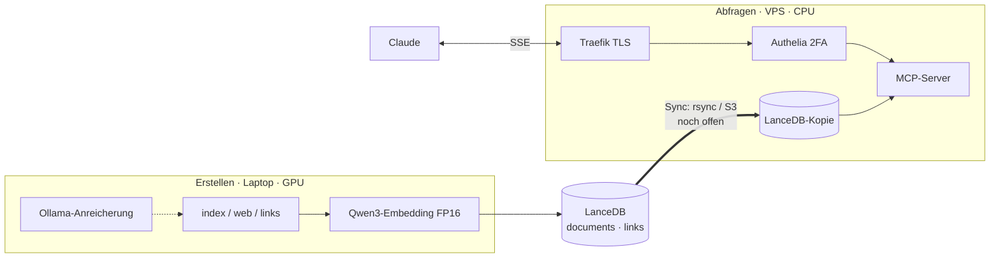

# Deployment

mykb trennt bewusst zwei Seiten: **Erstellen** (Laptop, GPU) und **Abfragen**
(VPS, CPU). Beide nutzen denselben asymmetrischen Embedder.



!!! danger "Alle Daten landen auf dem VPS"
    Entscheidung: der gesamte Speicher wird synchronisiert — also können auch
    **private/vertrauliche Inhalte** remote liegen. Die Absicherung ist daher
    **Pflicht**: TLS erzwingen, Authelia 2FA, Rate Limiting, Logging. Streng
    vertrauliche (z. B. NDA-gebundene) Dokumente im Zweifel in einer getrennten,
    lokalen Instanz halten.

## Inhalt von `deploy/`

| Datei | Zweck |
|---|---|
| `Dockerfile` | Image für Ingest + MCP-Server |
| `docker-compose.yml` | Traefik + Authelia + MCP-Server |
| `authelia/configuration.example.yml` | Authelia-Config (Vorlage) |
| `authelia/users_database.example.yml` | Benutzerdatenbank (Vorlage) |

## Inbetriebnahme

```bash
cd deploy

# 1. Domain und ACME-E-Mail setzen
export DOMAIN=mykb.example.com ACME_EMAIL=admin@example.com

# 2. Authelia konfigurieren (Secrets NICHT ins Repo)
cp authelia/configuration.example.yml   authelia/configuration.yml
cp authelia/users_database.example.yml  authelia/users_database.yml
#    -> Secrets/Hashes setzen, default_policy bleibt deny

# 3. Bauen und starten
docker compose up -d --build

# 4. Index befüllen (einmalig / nach Änderungen)
docker compose run --rm mcp python -m mykb index --source all
```

## Sicherheitsmerkmale

- **TLS erzwingen** — HTTP wird auf HTTPS umgeleitet, Zertifikate via
  Let's Encrypt (ACME).
- **2FA** — Authelia-`default_policy` ist `deny`; der MCP-Router nutzt die
  `authelia@docker`-Middleware (`two_factor`).
- **Rate Limiting** — Authelia-`regulation` gegen Brute-Force.
- **Secrets** — über Docker Secrets / Environment, nie im Repo.

## Sync (noch offen)

LanceDB sind nur Dateien. Der Transport Laptop → VPS ist bewusst noch nicht
festgelegt — Optionen: `rsync` über SSH oder Object Storage (S3/MinIO), aus dem
der VPS direkt liest. Die Konfiguration ist über Environment-Variablen bereits
entkoppelt (siehe [Konfiguration](konfiguration.md)).

## GPU im Container

Das Default-Image ist CPU-only (passt zur VPS-Abfrageseite). Für GPU-Ingest ein
CUDA-Basisimage wählen, das nvidia-Runtime im Compose aktivieren und
`EMBED_DEVICE=cuda` setzen.
