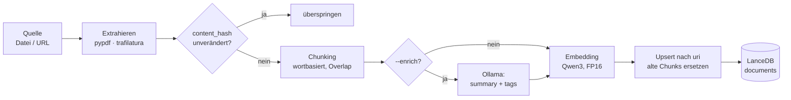

# Inhalte erfassen

Die Erstellungsseite (Laptop) überführt Quellen in die Tabelle `documents`.
Drei Quelltypen kommen hier hinein: **document**, **note** und **web**
(Bookmarks siehe [Linksammlung](links.md)).

## Befehle

```bash
# Lokale Quellen indexieren (alles / nur Dokumente / nur Notizen)
python -m mykb index --source all
python -m mykb index --source documents
python -m mykb index --source notes

# Einzelne Web-Seite aufnehmen (HTML -> Text)
python -m mykb web https://example.org/artikel --collection lesen --tags infosec

# Mit KI-Anreicherung (Zusammenfassung + Auto-Tags, siehe KI-Features)
python -m mykb index --source all --enrich

# Optionen
EMBED_DIM=512 python -m mykb index --source all     # Embedding-Dim kürzen
EMBED_DEVICE=cpu python -m mykb index --source all  # CPU erzwingen
```

## Die Ingest-Pipeline



1. **Extrahieren** — PDF via `pypdf`, HTML via `trafilatura` (Fallback
   BeautifulSoup), Text direkt.
2. **Änderungserkennung** — über den SHA-256-Hash des Inhalts (`content_hash`).
   Unveränderte Quellen werden übersprungen; Dubletten gleichen Inhalts ebenso.
3. **Chunking** — wortbasiert mit `CHUNK_SIZE` und `CHUNK_OVERLAP`.
4. **Anreicherung (optional)** — lokaler LLM erzeugt Zusammenfassung + Auto-Tags.
5. **Embedding** — Passages **ohne** Instruction-Prefix (asymmetrisch, siehe
   [Architektur](architektur.md)).
6. **Upsert** — alle Chunks einer `uri` werden ersetzt (inkrementell, der
   Link-Status in `links` bleibt unberührt).

!!! note "Defensive Extraktion"
    Eine fehlerhafte Datei oder URL bricht den Lauf nicht ab — sie wird geloggt
    und übersprungen.

## Felder in `documents`

| Feld | Bedeutung |
|---|---|
| `id` | `<hash16>_<chunk-index>` |
| `source_type` | `document` / `note` / `web` / `link` |
| `collection` | Sammlung (z. B. aus Unterordner oder gesetzt) |
| `tags` | Schlagworte (eigene + ggf. Auto-Tags) |
| `title`, `source`, `url` | Anzeige- und Herkunftsangaben |
| `content` | Chunk-Text |
| `summary` | KI-Zusammenfassung (nur mit `--enrich`) |
| `uri` | stabile Quell-Kennung (Pfad/URL) — Upsert-Schlüssel |
| `content_hash` | SHA-256 des Quellinhalts |
| `chunk_index`, `n_chunks`, `pages` | Position/Umfang |
| `indexed_at` | Zeitstempel (für die Timeline) |
| `vector` | Embedding |

!!! warning "Schema-/Modellwechsel = neu indexieren"
    Vektordimension stammt aus dem Modell (Qwen3-0.6B: 1024, optional per
    `EMBED_DIM` gekürzt). Modellwechsel, Dimensions- oder Schema-Änderung
    erfordern einen Neuaufbau der Tabelle.

Weiter mit der [Linksammlung](links.md).
