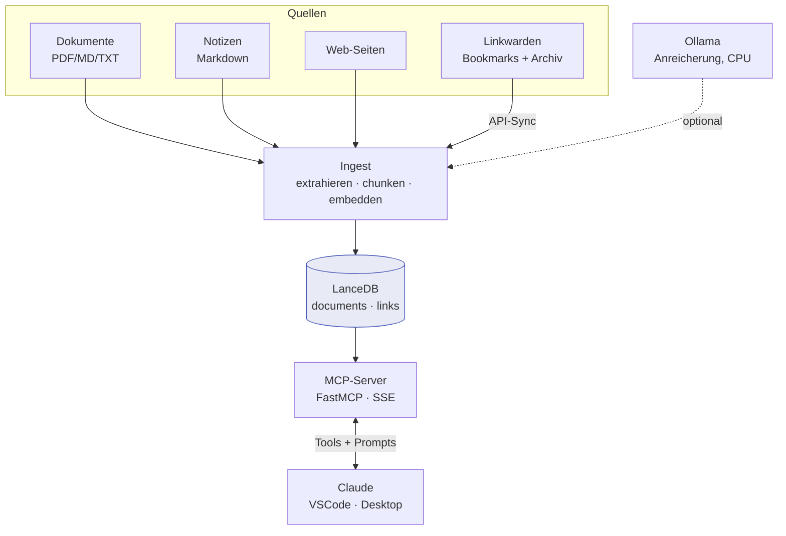

# Überblick

**mykb** ist ein selbst gehosteter, persönlicher Wissensspeicher (Personal
Knowledge Management). Eigene **Dokumente**, **Notizen**, **Web-Inhalte** und
eine **Linksammlung** werden mit semantischen Embeddings in **LanceDB**
indexiert und über einen **MCP-Server** im Alltag aus Claude (VSCode, Claude
Desktop) nutzbar gemacht — semantische Treffer statt Volltext-Grep,
sprachübergreifend zwischen Deutsch und Englisch.

!!! info "Leitlinien"
    Stack **lokal ohne Cloud** (LanceDB ist serverless, dateibasiert). Modelle
    bevorzugt **kommerziell lizenzierbar** (Apache 2.0); Tooling darf auch
    Copyleft sein (Eigenbetrieb). Bookmarks kommen aus **Linkwarden**, der
    KI-Layer im Alltag ist **Claude über MCP**.

## Vier Quelltypen, ein Index

Alles landet in der Tabelle `documents` (Feld `source_type`) und ist damit
einheitlich durchsuchbar:

- **document** — lokale Dateien (PDF, Markdown, Text)
- **note** — eigene Notizen (Markdown, Zettelkasten/Obsidian-Stil)
- **web** — abgerufene Web-Seiten (HTML → Text)
- **link** — Bookmarks mit Snapshot des Seiteninhalts (aus Linkwarden)

## Architektur auf einen Blick

## Warum semantische Suche?

Eine Stichwortsuche findet „ISO 27001 Annex A.8" nur bei exakter Zeichenkette.
Die Embedding-Suche findet auch Passagen, die dasselbe Konzept anders benennen
(z. B. „Asset Management" oder „Inventarisierung von Werten") — sprachübergreifend.

## Nächste Schritte

- [Installation](installation.md) — Umgebung einrichten
- [Inhalte erfassen](erfassen.md) — Dokumente, Notizen, Web indexieren
- [Linksammlung](links.md) — Linkwarden anbinden, Link-Rot prüfen
- [KI-Features](ki-features.md) — Anreicherung, Patterns, Auto-Sammlungen
- [MCP-Server](mcp-server.md) — Suche in Claude einbinden
- [Konfiguration](konfiguration.md) — Environment-Variablen
- [Deployment](deployment.md) — Erstellen (Laptop) vs. Abfragen (VPS)
- [Architektur & Modelle](architektur.md) — Modellwahl und Hintergründe
