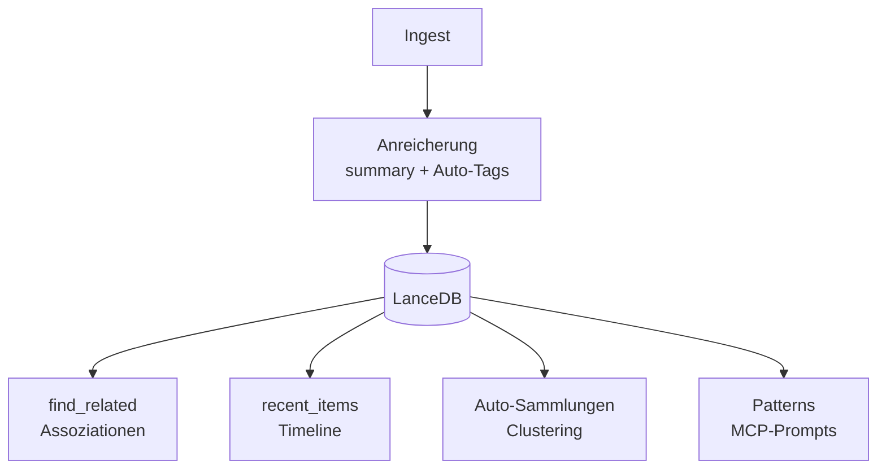

# KI-Features

Inspiriert von [fabric.so](https://fabric.so): Gespeichertes wird inhaltlich
„verstanden", verknüpft und nach Bedeutung nutzbar. Bei mykb übernimmt das
teils ein **lokaler LLM (Ollama, CPU)** beim Ingest, teils **Claude** über
MCP-Tools und Prompts.



## Anreicherung beim Ingest

Mit `--enrich` (oder `ENRICH=1`) erzeugt ein lokales Ollama-Modell je Quelle
eine **Zusammenfassung** (`summary`) und **automatische Schlagworte**, die zu
den eigenen `tags` ergänzt werden. Läuft bewusst auf **CPU/RAM**, um nicht mit
dem Embedder um VRAM zu konkurrieren.

```bash
python -m mykb index --source all --enrich
```

```bash
# .env
ENRICH=1
OLLAMA_URL=http://localhost:11434
OLLAMA_MODEL=llama3.2
```

!!! note "Defensiv"
    Ist Ollama nicht erreichbar oder die Antwort unbrauchbar, wird ohne
    Anreicherung weiter indexiert.

## Patterns (MCP-Prompts)

Kuratierte Analyse-Prompts à la Daniel Miesslers „fabric", in Claude auf eine
`uri` anwendbar — der Server lädt den Volltext und hängt ihn an die Anweisung:

| Pattern | Zweck |
|---|---|
| `summarize` | prägnante Zusammenfassung |
| `extract_wisdom` | Kernideen, Erkenntnisse, Empfehlungen |
| `extract_claims` | überprüfbare Behauptungen einordnen |
| `action_items` | konkrete To-dos ableiten |

## Verwandtes (Assoziationen)

`find_related(uri)` liefert semantisch nahe Inhalte zu einem Element — nützlich,
um von einer Fundstelle aus Zusammenhänge zu entdecken (Vektor-Nachbarn, je
Quelle nur der nächste Treffer, Ausgangselement ausgeschlossen).

## Auto-Sammlungen (Clustering)

`mykb collections` gruppiert Dokumente nach Themen (greedy Cosinus-Clustering
der Vektoren) und benennt jedes Cluster über das häufigste Tag. Vorschlag
ansehen, dann optional anwenden:

```bash
python -m mykb collections --threshold 0.6
python -m mykb collections --apply        # setzt das Feld collection
```

## Timeline

`recent_items(limit, source_types?)` liefert die zuletzt hinzugefügten Elemente
(über `indexed_at`), optional nach Quelltyp gefiltert.

Weiter mit dem [MCP-Server](mcp-server.md).
