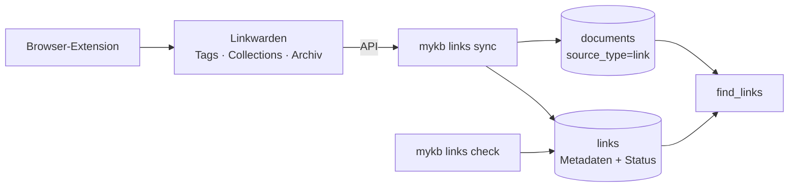
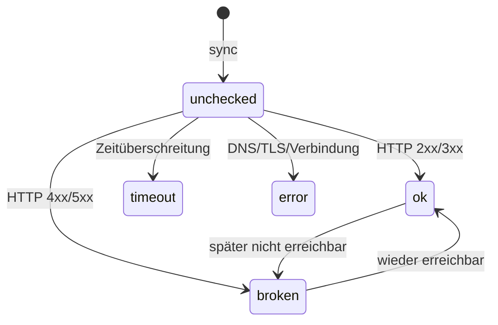

# Linksammlung

Bookmarks werden nicht im Eigenbau erfasst, sondern in
[**Linkwarden**](https://github.com/linkwarden/linkwarden) (Browser-Extension,
Tags, Collections, Archivierung). mykb ist die Index- und MCP-Schicht darüber:
es übernimmt die Links, macht ihren Inhalt **semantisch durchsuchbar** und
prüft regelmäßig die **Erreichbarkeit** (Link-Rot).



## Einrichtung

In `.env` Basis-URL und API-Token der Linkwarden-Instanz hinterlegen (Secret,
nicht ins Repo):

```bash
LINKWARDEN_URL=https://links.example.com
LINKWARDEN_TOKEN=…
```

## Befehle

```bash
# Links aus Linkwarden übernehmen und ihren Lesetext indexieren
python -m mykb links sync

# Erreichbarkeit prüfen (Link-Rot) und Status aktualisieren
python -m mykb links check

# Auflisten (alle / nur problematische)
python -m mykb links list
python -m mykb links list --broken
```

## Was beim Sync passiert

`links sync` zieht die Links per API, übernimmt Metadaten in die
`links`-Tabelle und indexiert den **Lesetext** als `source_type = link` in
`documents`. Bevorzugt wird der von Linkwarden gelieferte Text; fehlt er, ruft
mykb die Seite selbst ab. So überlebt der Inhalt auch Link-Rot und ist über
`find_links` auffindbar.

## Erreichbarkeitsstatus (Link-Rot)

`links check` ruft jede URL ab und ordnet den Status ein:



Das MCP-Tool `find_links(query, only_alive=True)` liefert standardmäßig nur
Links mit Status `ok` — siehe [MCP-Server](mcp-server.md).

!!! tip "Planmäßig prüfen"
    `links check` lässt sich per Cron oder systemd-Timer regelmäßig ausführen,
    damit der Status aktuell bleibt.

Weiter mit den [KI-Features](ki-features.md).
