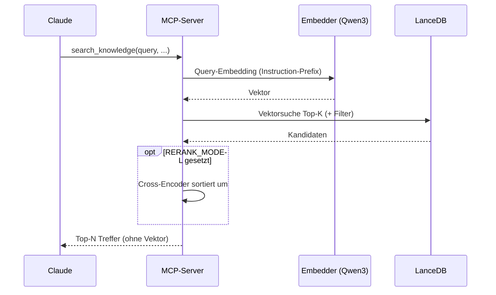

# MCP-Server

`server/server.py` stellt den LanceDB-Wissensspeicher als **MCP-Server**
(FastMCP, SSE-Transport) bereit. Claude bindet ihn als Werkzeug ein und kann
den Speicher semantisch durchsuchen, Verwandtes finden und Patterns anwenden.

## Starten

```bash
python server/server.py
```

Der Server lauscht auf `MCP_HOST:MCP_PORT` (Default `0.0.0.0:8000`) und bietet
den SSE-Endpoint unter `/sse` an.

## In Claude einbinden

In der MCP-Client-Konfiguration (VSCode `settings.json` oder Claude Desktop)
einen SSE-Server eintragen:

```json
{
  "mcpServers": {
    "mykb": {
      "url": "http://localhost:8000/sse"
    }
  }
}
```

Im Remote-Betrieb steht statt `localhost` die über Traefik veröffentlichte
Domain (mit TLS und Authelia davor, siehe [Deployment](deployment.md)).

## Tools

| Tool | Zweck |
|---|---|
| `search_knowledge(query, source_types?, collection?, limit?)` | semantische Suche über alle Quelltypen, optional gefiltert |
| `find_links(query, only_alive?, limit?)` | Link-Snapshots durchsuchen + Bookmark-Status |
| `find_related(uri, limit?)` | semantisch verwandte Inhalte zu einem Element |
| `recent_items(limit?, source_types?)` | zuletzt hinzugefügte Elemente (Timeline) |
| `get_document_context(uri, chunk_index, window?)` | benachbarte Chunks einer Fundstelle |
| `kb_status()` | Bestände, Link-Status, Queue-Rückstand, letzter Lauf/Sync |

## Prompts (Patterns)

Zusätzlich stehen kuratierte Analyse-Prompts bereit, anwendbar auf eine `uri`:
`summarize`, `extract_wisdom`, `extract_claims`, `action_items` — Details unter
[KI-Features](ki-features.md).

## Wie die Suche abläuft



1. **Query-Embedding** mit Qwen3-Instruction-Prefix (asymmetrisch, gespiegelt
   aus der Ingestion — siehe [Architektur](architektur.md)).
2. LanceDB liefert die Top-`SEARCH_TOP_K` Kandidaten, optional mit Filter
   (Quelltyp/Sammlung).
3. **Optional:** Ist `RERANK_MODEL` gesetzt, sortiert ein Cross-Encoder um
   (defensiv: schlägt das Laden fehl, läuft die Suche ohne Reranking weiter).
4. Die Top-`SEARCH_RETURN_K` Treffer gehen zurück — ohne den Vektor.

!!! note "Performance"
    Modelle werden erst beim ersten Tool-Aufruf geladen (langer Start, knappes
    VRAM-Budget) und danach zwischengespeichert.

## Datenschutz im Log

Queries werden nur **gekürzt** geloggt (Vorschau), niemals als Klartext. Logs
sind strukturiert (JSON über `structlog`).

Weiter mit der [Konfiguration](konfiguration.md).
